# Working Notes
# Problem
Create a ranking system based on GitHub user activity.

TODO: Figure out what fundamental value this provides. Why is it useful?

# Goals
* Create an event-ingestion system for GitHub user events
* Analyze events to generate a user-score
* Create a service to publish our user-score

# Assumptions
* The messages will be rather small (< 256k)

# Design

# Discussion
## Architecture
Considering the stated request is to just "return aggregate scores" for users,
my initial inclination was to back this store with DynamoDB. The stats for any
particular user doesn't affect any other user, so the data model fits.
Additionally, DynamoDB would allow us to dynamically scale costs and capacity
as our service grows.

However, if somebody asks to see, for example, the top ten users, DynamoDB will
require a table scan.

Therefore, I'm going to go ahead and back this with Datomic.

The hard constraint with Datomic is write throughput. We can mitigate this by
putting a queue in front of our ingestion engine. This will allow us to adjust
Datomic writes independent of how fast events are transmitted to us. This puts
pressure on the queuing system to hold however many events are currently
uncommitted to Datomic. SQS allows for unlimited queue size. If we decide to
use, for example, Kafka, multi-terabyte drives ought to be sufficient to hold
all in-flight messages (as the [messages will be rather small](#assumptions)).

We can still use DynamoDB as Datomic's backing storage to ensure that our costs
and capacity scales.
